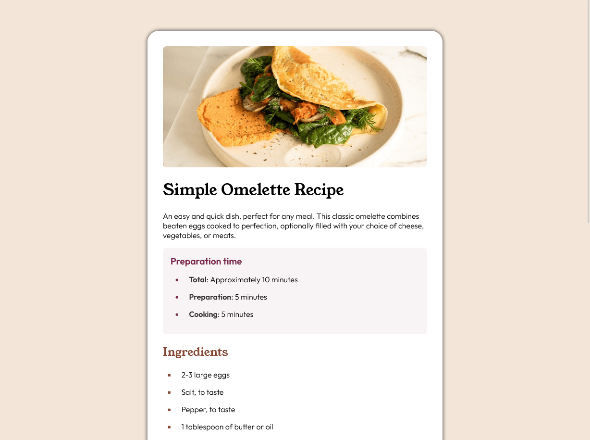

# Frontend Mentor - Recipe page solution

Esta es una solucion al desafio [Recipe page challenge en Frontend Mentor](https://www.frontendmentor.io/challenges/recipe-page-KiTsR8QQKm).

## Overview

### Screenshot

### 🚀 Demo

- [Recipe-page-solution](https://kaelldrick.github.io/Recipe-page-solution/)

### 💻 Built with

- HTML5 semántico
- CSS 

## Author

- Frontend Mentor - [@Kaelldrick](https://www.frontendmentor.io/profile/Kaelldrick)
